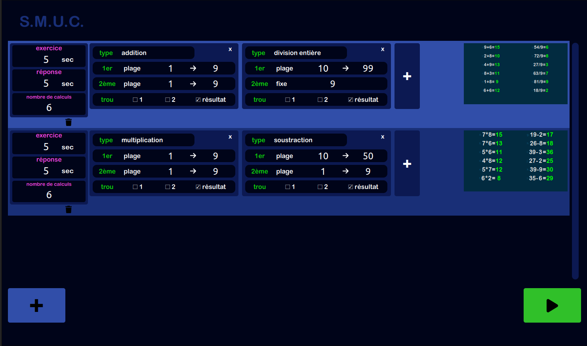
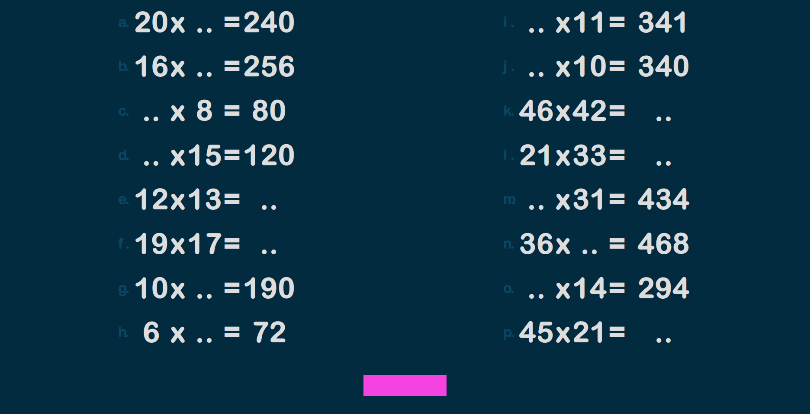

# Calculs

Generate math exercice.

Get it : [Download](https://github.com/RemiGirard/calculs/releases/download/v1.9.0/index-1.9.0.html)

## Use with docker
### Requirement

- [Docker-compose](https://docs.docker.com/compose/install/)

### build locally

build image
- `docker compose build`

build container without volume binding
- `docker compose -f docker-compose.yml create`

copy `node_modules` folder from container to local folder
- `docker compose cp calculs:/srv/app/node_modules/ ./` 

run
- `docker compose up`
- open browser at http://localhost:1420/

Edit files inside `src/`. Changes will be updated with HMR.

### run unit tests

- `docker compose exec calculs pnpm test`

vitest runs in watch mode by default

### build html

- `docker compose exec calculs pnpm build`

Unique html file will be available at `dist/index.html`

## Use with local server

### Requirement

- [node](https://nodejs.org/en)
- [pnpm](https://pnpm.io/installation)

### build

- `pnpm install`

### run

- `pnpm dev`
- open browser at http://localhost:1420/

### run unit tests
- `pnpm test`

### build html
- `pnpm build`

### build exe/dmg/deb

[Tauri requirements](https://tauri.app/v1/guides/getting-started/prerequisites)

- `pnpm tauri build`

Executables will be available at `src-tauri/target/release/` , installers `src-tauri/target/release/bundle`.

