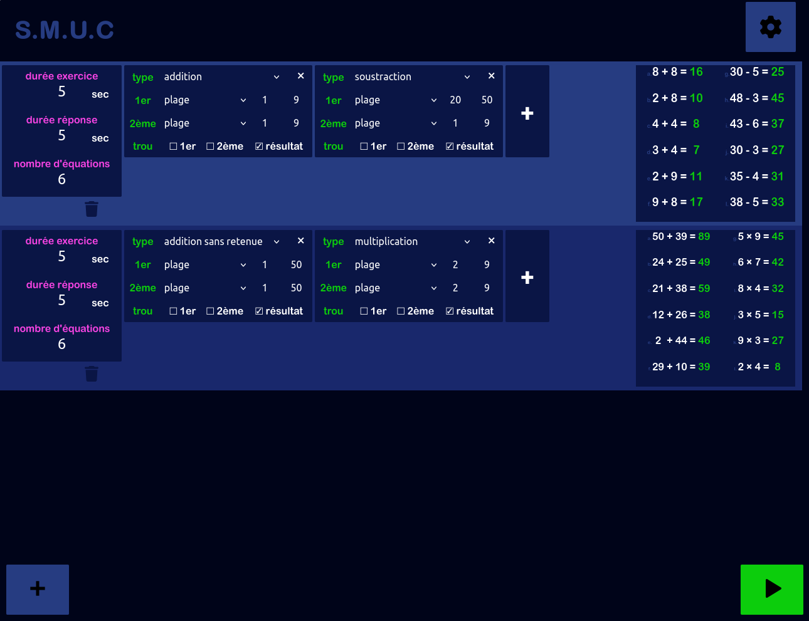
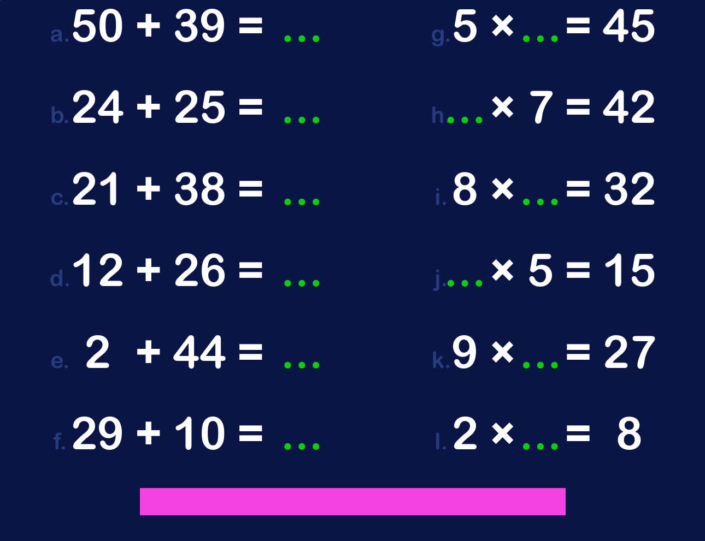

# Calculs

Generate math exercise.

[Demo](https://remigirard.github.io/calculs/)

## Requirement

- [Docker-compose](https://docs.docker.com/compose/install/)

or use directly with [pnpm](https://pnpm.io/installation) and `package.json` scripts (example: `pnpm dev`)

## Use

### dev

- `docker-compose up`
- open browser at http://localhost:5173/

Edit files inside `src/`. Changes will be updated with HMR.

### build html

- `docker-compose exec calculs pnpm build`

Unique html file will be available at `dist/index.html`
