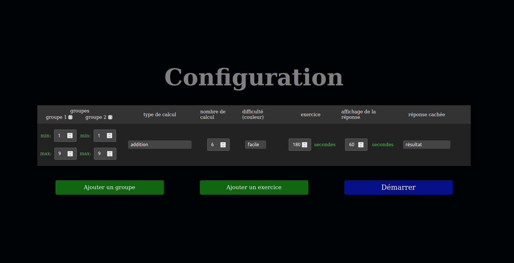
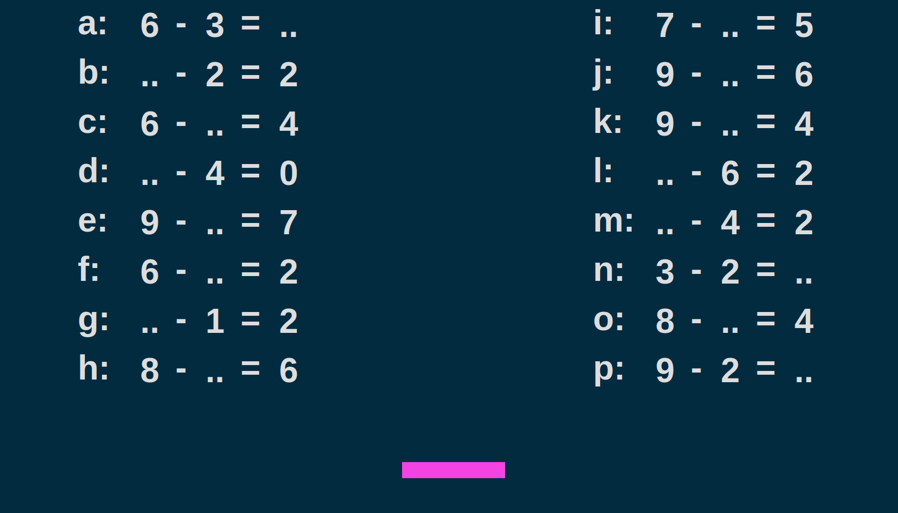

# Calculs

Generate math exercice.

Get it : [Download](https://github.com/RemiGirard/calculs/releases/download/v1.0.0/index.html)

## Requirement

- [Docker-compose](https://docs.docker.com/compose/install/)

or use directly with [pnpm](https://pnpm.io/installation) and `package.json` scripts (example: `pnpm dev`)

## Use

### dev

- `docker-compose up`
- open browser at http://localhost:1420/

Edit files inside `src/`. Changes will be updated with HMR.

### build html

- `docker-compose exec calculs bash`
- `pnpm build`

Unique html file will be available at `dist/index.html`

### build exe/dmg/deb

[Tauri requirements](https://tauri.app/v1/guides/getting-started/prerequisites)

- `pnpm tauri build`

Executables will be available at `src-tauri/target/release/` , installers `src-tauri/target/release/bundle`.
